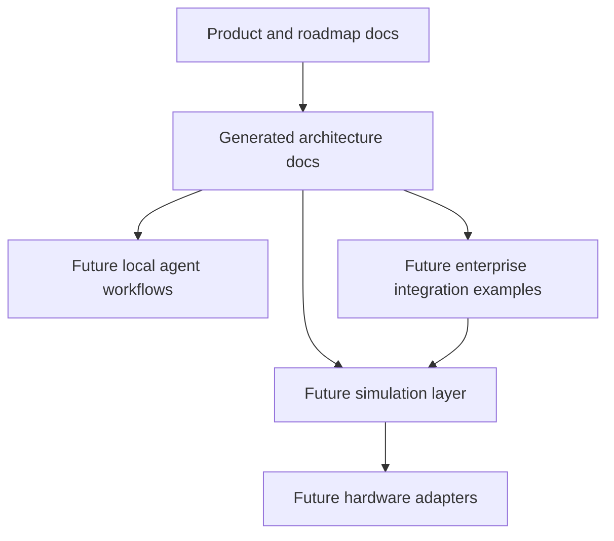

<!-- generated-by: gsd-doc-writer -->
# Architecture

## System Overview

Valera Control Tower is currently a documentation-first robotics and AI integration PoC. The intended system is layered: product and architecture documentation define the control-tower concept first, future simulation code models robot tasks and state, future agent workflows support local development and operations, and future enterprise integration examples translate robot activity into business-style commands, events, and status updates. The repository has not yet implemented runtime robot control, API routes, CLI commands, or hardware adapters.

## Component Diagram



## Data Flow

The intended PoC flow is documented rather than implemented:

1. A business-style task is defined by a user or workflow.
2. The task is translated into a robot command plan.
3. A simulation-first execution layer updates robot state and produces structured logs or result output.
4. Enterprise-style integration artifacts can represent the task, status, event, or result in business process language.
5. Real hardware control remains a later phase and must include explicit safety notes.

## Key Abstractions

No source-level abstractions are implemented yet. The current repository defines these project concepts in documentation:

| Concept | Current Source | Purpose |
|---|---|---|
| Product brief | `docs/product-brief.md` | Defines the one-line idea, target audience, first PoC scenario, and non-goals. |
| Roadmap | `docs/roadmap.md` | Stages repository foundation, simulation, hardware abstraction, agent workflow, enterprise integration, and hardware demo work. |
| Agent benchmark | `docs/agent-benchmark.md` | Defines benchmark rules and evaluation metrics for comparing agent workflows. |
| Agent instructions | `AGENTS.md` | Defines project identity, safety boundaries, architecture preferences, and development style. |
| Codex notes | `CODEX.md` | Captures Codex-specific working style and project direction. |

## Directory Structure Rationale

Current repository structure:

```text
.
├── AGENTS.md
├── CODEX.md
├── README.md
├── docs/
│   ├── agent-benchmark.md
│   ├── product-brief.md
│   └── roadmap.md
└── prompts/
    └── agent-benchmark/
        └── task-a-architecture-skeleton.md
```

The existing repository is intentionally small. `docs/` holds product, roadmap, benchmark, and generated project documentation. `prompts/` holds reusable benchmark prompts. Future implementation directories should follow the project preference from `AGENTS.md`: robot domain code, enterprise schemas, agent workflows, experiments, and repeatable scripts should remain separated.
